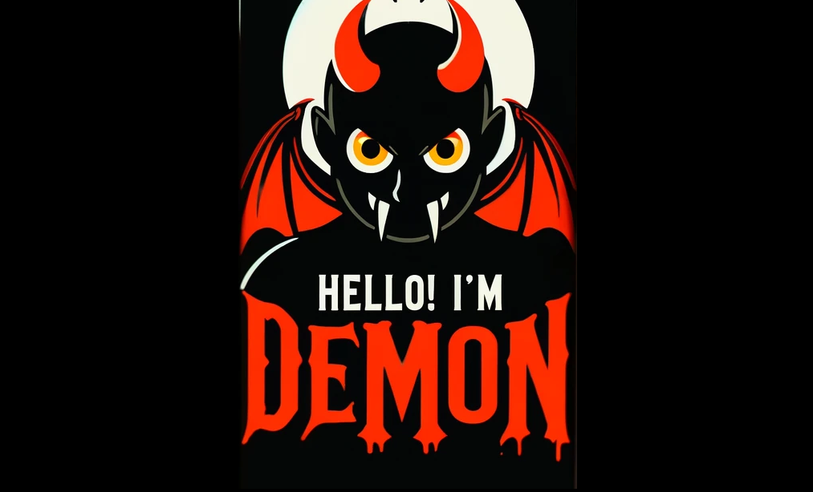

### HI STRANGE
- 🔭 I’m currently working on **iston edu**.
- 🌱 I’m currently learning how to **earn a living...**
- 👯 I’m looking to collaborate on ...
- 🤔 I’m looking for help with **earning a living...**
- 💬 Ask me about ...
- 📫 How to reach me: wwwwwdemon@gmail.com
- 😄 Pronouns: ??? ruthless code machine (无情码机）
- ⚡ Fun fact: hhhhhhhhhhhhhhhhhhhh

|  |  |
| ------------- | ------------- |

<!--
**lilhammer111/lilhammer111** is a ✨ _special_ ✨ repository because its `README.md` (this file) appears on your GitHub profile.

Here are some ideas to get you started:

- 🔭 I’m currently working on ...
- 🌱 I’m currently learning ...
- 👯 I’m looking to collaborate on ...
- 🤔 I’m looking for help with ...
- 💬 Ask me about ...
- 📫 How to reach me: ...
- 😄 Pronouns: ...
- ⚡ Fun fact: ...
-->
